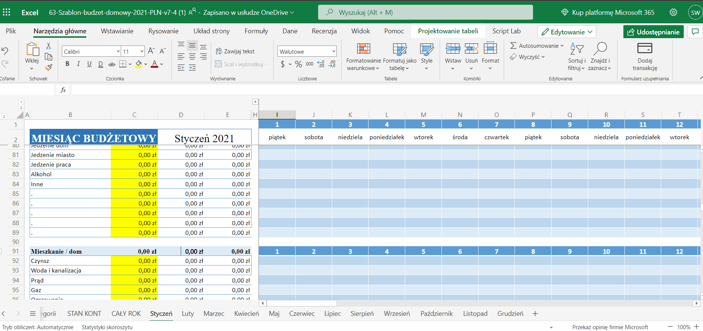
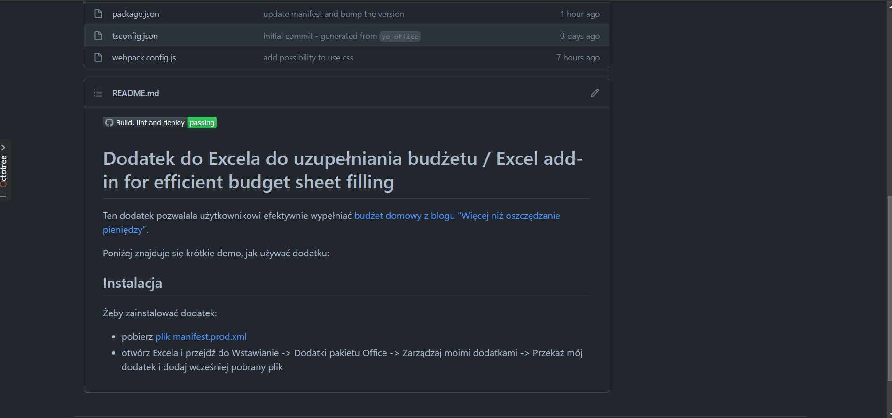

# Dodatek do Excela do uzupełniania budżetu / Excel add-in for efficient budget sheet filling

## Wstęp / Introduction

### Opis funcjonalność

Ten dodatek pozwalala użytkownikowi efektywnie wypełniać [budżet domowy z blogu "Więcej niż oszczędzanie pieniędzy"](https://jakoszczedzacpieniadze.pl/budzet-domowy-2021-szablon-arkusz-excel). Dzięki niemu nie musisz już więcej nawigować po całym pliku dodając nowe transakcję i spędzać czasu na szukaniu odpowiedniej kategorii i dnia. Zamiast tego wpisz odpowiednie wartości w formularzu a odpowiednie wartości dodadzą się automatycznie. Szybciej i prościej!

Poniżej znajduje się krótkie demo, jak używać dodatku:

### Instalacja

Żeby zainstalować dodatek:

- pobierz [plik manifest.prod.xml](./manifest.prod.xml)
- otwórz Excela i przejdź do Wstawianie -> Dodatki pakietu Office -> Zarządzaj moimi dodatkami -> Przekaż mój dodatek i dodaj wcześniej pobrany plik

Wideo:

---

## English

### Functionality description

This add-in allows the user to effectively fill in the [budget sheet from "Więcej niż oszczędzanie pieniędzy" blog](https://jakoszczedzacpieniadze.pl/budzet-domowy-2021-szablon-arkusz-excel). With it you no longer have to navigate around the whole file when trying to add new transaction and spend time on looking for appropriate category or day. Instead just put to desired values in the form and the sheet will be filled automatically. Faster and easier!

Below there is a short video presenting the functionality:

### Instalation

To install the add-in:

- download [plik manifest.prod.xml](./manifest.prod.xml)
- open Excel and go to Insert -> Office add-ins -> Manage my add-ins -> Manage my add-in and use previously downloaded file

Wideo:

## Technical details

The add-in is built with React+typescript. It is based on [the official template for Office add-ins](https://github.com/officedev/generator-office) and created using guides available at [Microsoft docs](https://docs.microsoft.com/en-us/office/dev/add-ins/develop/develop-overview). To be compliant with the [Office design guidelines](https://docs.microsoft.com/en-us/office/dev/add-ins/design/add-in-design), the add-in leverages the described [design pattern](https://docs.microsoft.com/en-us/office/dev/add-ins/design/ux-design-pattern-templates) as well as [Fluent UI library](https://developer.microsoft.com/en-us/fluentui#/) for native Office feel and accessibility.
